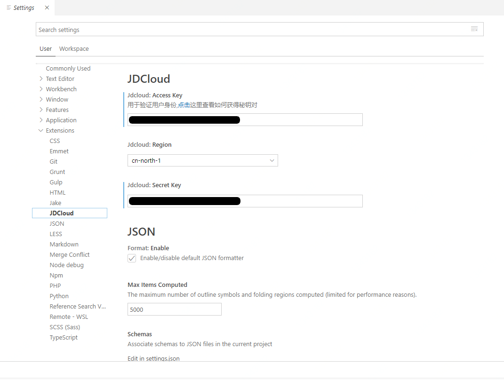
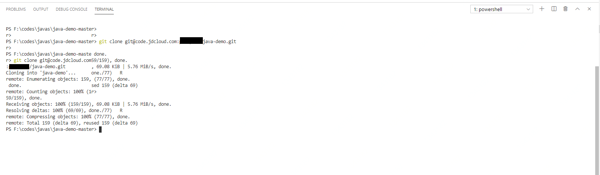
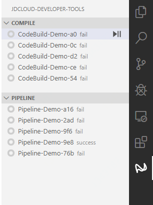

# 入门指南

1. 安装VScode

   > https://code.visualstudio.com/Download

2. 安装插件：

   VScode的位置在：

3. 安装完成后需要输入AK/SK

   第一次使用插件时需要输入AK/SK。

   进入京东云控制台-账号管理-Access Key管理，创建并获取Access Key。

   

   在File-Preferences-Settings-Extensions-JDCloud中填入AK/SK，并设置要使用的region，目前仅支持单region。填写AK/SK之后可以直接进行连接测试。

   

   ### public key导入

   windows存放public key的位置是：

   > C:\Users\XXXXX\\.ssh

   在该目录下，使用命令ssh-keygen生产密钥。并将public key导入到代码托管中。具体位置在：

   代码托管-管理-SSH key管理，参考文档：

   > https://docs.jdcloud.com/cn/codecommit/ssh-key

4. 在云编译/流水线任务中**创建示例**。

5. 跳转至示例中的代码库**java-demo**

6. 在VScode中利用内置的git命令拉取java-demo仓库到本地

   

7. 通过VScode打开该项目，可以看见右侧显示出该代码相关的云编译和流水线任务。

   

8. COMPILE下方是该项目最近的5个云编译任务，PIPLELINE是该项目最近的5个流水线任务

   选择任务后可以点击启动按钮，启动相应的服务。在服务运行的过程中，VScode自带的OUTPUT区域会显示执行过程中的回显的日志信息。同时此任务记录也可以通过控制台查询到。

