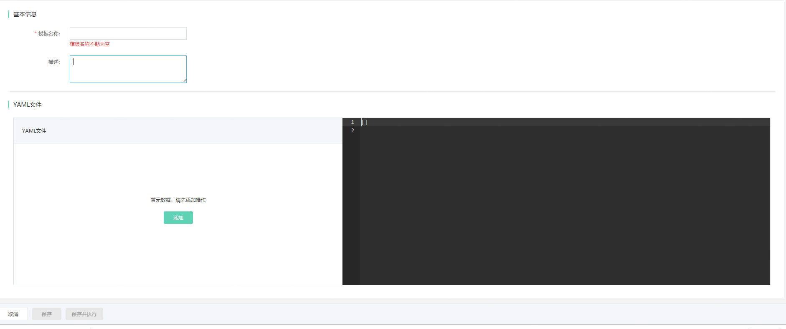
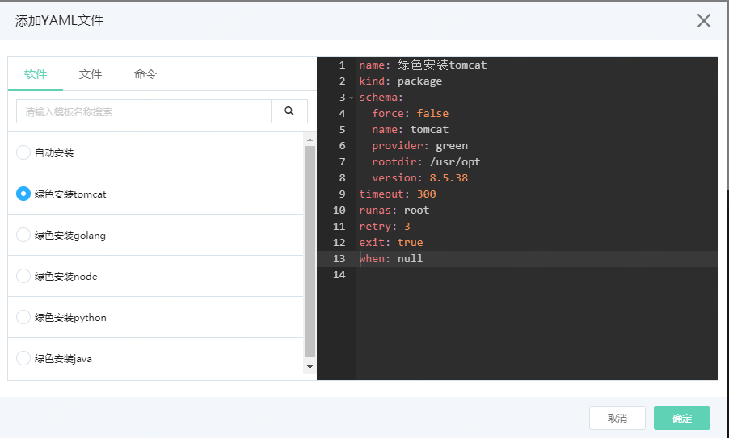
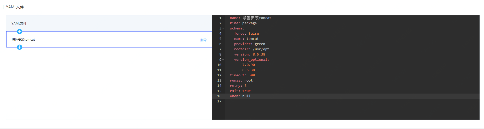

# 构建模板

1. 在模板管理页面点击**创建**，跳转至编辑模板页面



2. 在编辑模板页面填写名称和描述

   注意：**名称不可以重复**，且必填

3. 按下方的**添加**按钮,出现弹窗。

4. 选择**安装tomcat**，点击**确定**



5. 此时模板中出现了**安装tomcat**的YAML 描述。如图所示：



6. 把鼠标移至左侧**绿色安装tomcat**时，会出现上下的两个加号，代表可以在此操作之前和之后添加其他操作。这次我们在之后添加操作选择**命令-执行shell命令**，用来编辑启动tomcat命令：
  ```shell
  将 echo hello
  替换为：
  sh /usr/opt/tomcat-8.5.38/bin/startup.sh
  ```

7. 点击**保存并执行**

