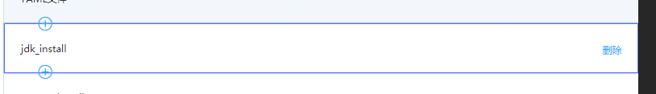

## 模板

  模板分为两类:用户模板和官方模板。

- 用户模板：由用户创建可以自行编辑，复用。

- 官方模板：由京东云提供，仅供用户复用。

  模板包含：名称、描述、操作三部分。

  对于每个用户而言，**模板名称不可以重复**。但可以与官方模板名称相同。

## 创建模板

  创建模板的方式有两种：分别是创建新的模板和复用模板

- 创建新的模板

    在**模板管理页面**点击**创建模板**即可跳转至编辑模板页面

- 复用模板

    点击模板卡片下方的**另存为**即可跳转至编辑模板页面

## 编辑模板

  编辑模板页面分为两个区域，左边的编排区域和右边的YAML描述区域。

**编排区域**

  编排区域中可以对每个操作进行顺序上的编排，也可以在每个操作前后再加入其它的操作。如图所示：

 点击上下的**加号**可以添加操作。点击删除可以**删除**该操作。

操作的顺序调整可以通过鼠标拖拽来实现。

**YAML区域**

每添加一个操作，YAML区域就会增加该操作的YAML描述。每个操作的name字段会显示在编排区域。

以下情况会报错：

- YAML格式不完整
- 操作name字段为空
- 操作kind字段错误

### 添加操作

操作分为三类：软件操作、文件操作、命令操作

 操作字段描述见：操作手册。

