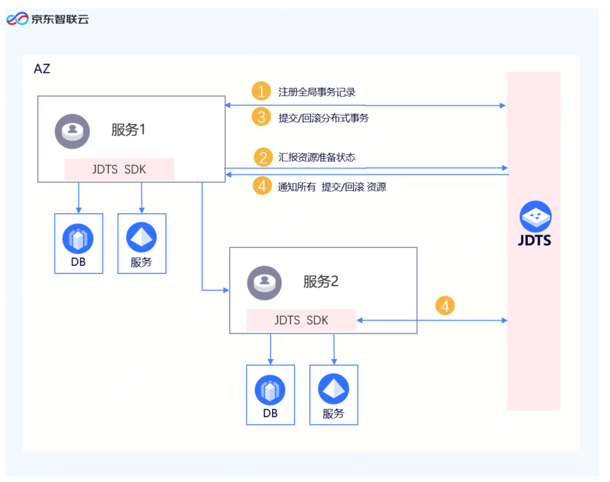

# 产品概述

在面向服务的架构设计中，当业务系统按照服务拆分之后，一个完整的业务调用链将会涉及到多个服务的调用，那么在分布式环境下如何保证多个服务间的交易数据一致性成为一个难题，因此分布式事务应需而生。目前分布式事务包含两种主流模式：AT模式和TCC模式。
-  AT模式

AT模式是一种自动重试机制模式，可通过API或者注释方式进行接入。在AT 模式下，用户只需关注自己的“业务 SQL”，用户的 “业务 SQL” 作为一阶段，分布式框架会自动生成事务的二阶段提交和回滚操作。

-  CC模式

TCC 模式是一种补偿性分布式事务，包含 Try、Confirm、Cancel 三阶段。 Try 阶段，资源的检测和预留； Confirm 阶段，执行业务提交并要求Try 成功则 Confirm 一定要能成功；Cancel 阶段，取消执行业务操作。
分布式事务处理的难点和关键，在于可以知道事务在任何地方所作的任何动作，保障提交或者回滚事务的决定必须产生统一的结果：要么全部提交，要么全部回滚。
京东智联云分布式事务（JDCloud&AI Distributed Transaction Service），简称JDTS，是京东智联云上提供实现分布式环境下保障业务一致性的产品。JDTS支持分布式长事务下的AT模式和TCC模式，提供了多种主流开发框架的SDK接入方案（Spring、Springboot、SringCloud、Dubbo等多种RPC方案），以较少代码侵入性最小化客户接入成本。
 

